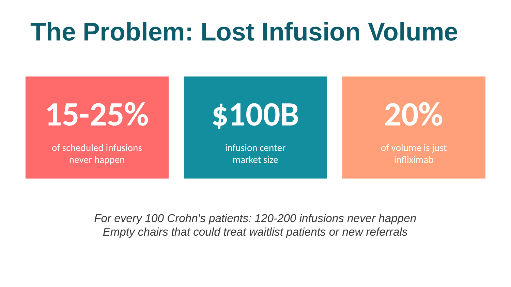
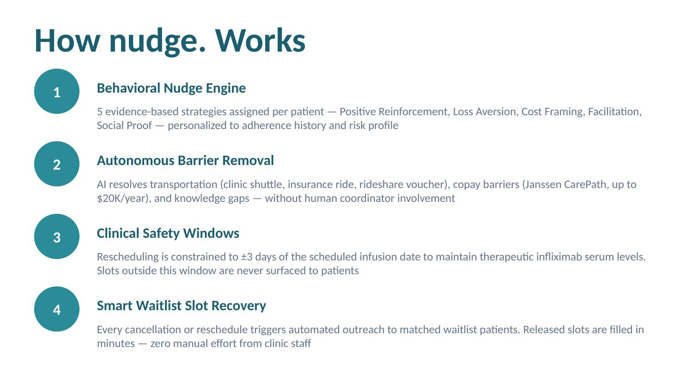
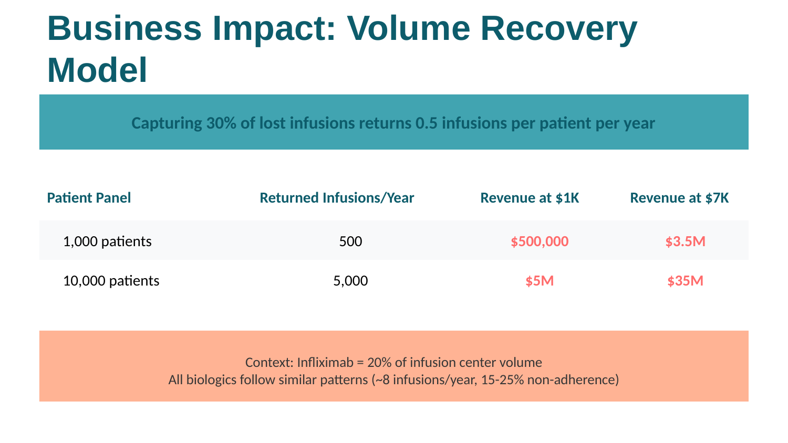

# nudge.
**AI-powered patient adherence platform for infusion centers — portfolio demo**

Non-adherence costs infusion centers 15–25% of scheduled volume. **nudge.** demonstrates how behavioral science, autonomous barrier removal, and smart waitlist matching can recover lost infusions at scale — without a single generic reminder.

[**Try Live Demo →**](https://annakuperberg.github.io/nudge-clinical-ai/) &nbsp;|&nbsp; [**Feature Lab →**]((https://annakuperberg.github.io/nudge-clinical-ai/#feature-lab
))

---

## What This Demo Shows

This is a fully self-contained, zero-cost portfolio demonstration built with hardcoded branching mock responses. No live API calls, no login required, no API key exposure. A hiring manager can open it in a browser and explore every capability immediately.

The demo simulates a real clinical AI assistant managing 5 distinct patient personas across a complete appointment confirmation workflow — from initial outreach through barrier resolution, education, and escalation.

---

## The Problem

Infusion centers lose 15–25% of scheduled volume to non-adherence. For every 100 Crohn's patients on infliximab receiving 8 infusions/year, 120–200 infusions never happen — empty chairs that could treat waitlist patients or accommodate new referrals.



**nudge.** demonstrates how to return these lost infusions to the system through:
- Personalized behavioral nudges matched to adherence profile
- Autonomous removal of logistical and financial barriers
- Clinical safety constraints enforced at every decision point
- Smart waitlist matching when slots are released

---

## The 5 Patient Personas

Each persona is designed to demonstrate a distinct adherence challenge and a corresponding behavioral intervention strategy.

| Patient | Persona | Adherence | Strategy |
|---|---|---|---|
| **Daniel Brooks** | Consistent Optimizer | 96% | Positive Reinforcement — celebrates streaks, minimal friction |
| **Jessica Miller** | Busy Deferrer | 72% | Loss Aversion — urgency framing, weekend/evening slots |
| **Marcus Johnson** | Financially Strained | 61% | Cost Framing — copay assistance before appointment confirmation |
| **Linda Garcia** | Logistical Barrier | 68% | Facilitation — proactive ride coordination before patient asks |
| **Tyler Nguyen** | Disengaged Skeptic | 43% | Social Proof + Re-engagement — outcome data, clinician escalation |

Each patient has a fully branching conversation tree covering every workflow path.

---

## Capabilities

Every feature is documented and demoed interactively in the **Feature Lab** — accessible from the chat header.



### 🧠 Behavioral Nudge Engine
Five evidence-based strategies assigned per patient based on adherence history and risk profile. The same appointment message is completely different for Daniel (streak celebration) vs. Tyler (outcome statistics). Strategy is visible on every AI message via a persistent feature tag.

### 📅 Smart Appointment Management
One-tap confirm, reschedule, and cancel flows with embedded clinical context. Reduces the cognitive effort that causes patients to defer action — the highest-impact intervention point in the adherence journey.

### ⏱ ±3-Day Clinical Safety Windows
Infliximab serum levels decline predictably between infusions. The system only surfaces rescheduling slots within the ±3-day therapeutic safety window — slots outside this range are never shown to patients. Clinically necessary, not just convenient.

### 🚌 Transportation Coordination
Proactive ride scheduling offered before the patient raises it as a barrier. Covers clinic shuttle (with address verification), insurance-covered transport, and rideshare vouchers. Addresses ~25% of infusion no-shows.

### 💰 Copay Assistance Activation
Janssen CarePath Savings Program ($0 copay, up to $20,000/year) surfaced at conversation start for financially strained patients — before cost becomes a stated reason to cancel. Triggered as the first message for Marcus.

### 📚 Patient Health Education
Four full clinical articles available in the Health Library, each opening in a dedicated reading modal:
- **Understanding Infliximab** — mechanism, infusion experience, why timing matters
- **Dietary Guidelines for IBD** — foods table, hydration, supplements
- **Managing Crohn's Flares** — warning signs, when to go to the ER, recovery
- **Lab Results Explained** — CRP, fecal calprotectin, trough levels, full blood count

Interactive health trivia reinforces the ±3-day safety window concept.

### 👤 Human-in-the-Loop Escalation
Always-available escalation to clinical coordinators or the treating physician (Dr. Torres for Tyler). Conversation context is shared automatically so coordinators are fully briefed. Triggered automatically for complex clinical concerns or explicit patient request.

### 🔔 Calendar & Reminder Integration
Calendar add-to offered immediately post-confirmation. Embeds the appointment into the patient's existing system — reduces reliance on memory, a core principle of behavioral design.

### 🔄 Waitlist Slot Recovery
Every cancellation or reschedule automatically releases a slot to the waitlist matching engine. Animated outreach flow shows the match — slot released → patient matched → AI outreach sent. Conversion rate: 88%.

---

## Feature Lab

The **Feature Lab** (🔬 button in the chat header) is a visual map of every capability:

- Each capability card explains **why it works** — the behavioral science or clinical rationale
- **Interactive demos** let reviewers try each feature without navigating through a conversation
- **Toggle switches** show how individual features can be enabled or disabled per clinic
- Every AI message in the chat is tagged with its generating feature so reviewers always know what they're seeing

---

## Clinical Safety Design

This demo is built around the same safety principles that would apply in a production clinical environment.

**Deterministic response engine** — all responses are hardcoded and fully reviewed. No stochastic AI variance in clinical recommendations.

**±3-day scheduling constraint** — the system cannot propose a slot outside the therapeutic safety window. Enforced at the data layer, not just the UI.

**Human escalation always available** — no patient concern is handled without a clear path to a qualified human.

**Modular feature governance** — every high-touch capability (transport, copay, education) can be toggled independently per clinic's actual resources, preventing the AI from promising something the clinic can't deliver.

**No medical advice** — the system coordinates logistics and education. Clinical decisions remain with the care team.

---

## Architecture

This demo is a single self-contained HTML file — intentionally simple for maximum portability.

```
nudge-demo.html
├── Patient personas (5)          — adherence profiles, strategies, nurse assignments
├── Conversation flows            — full branching mock response trees per patient
├── Feature Lab                   — capability cards, demos, toggles, rationale
├── Health Library                — 4 full clinical articles with reading modal
├── Capability tagging system     — every AI message labeled with its feature
└── Zero external dependencies    — no API calls, no build step, no login
```

**Production architecture** (original Nudge, available separately):

- **Frontend:** React 19, TypeScript, Vite, Tailwind CSS
- **AI:** Google Gemini API with function calling and autonomous tool use
- **Deployment:** Google Cloud Run (containerized, auto-scaling)
- **Data models:** FHIR-compatible patient state, clinical notes, appointments
- **Security:** Server-side API credential management via Cloud Functions proxy

---

## Business Impact

Capturing 30% of lost infusions returns 0.5 infusions per patient per year.



| Patient Panel | Returned Infusions/Year | Value at $1K/infusion | Value at $7K/infusion |
|---|---|---|---|
| 1,000 patients | 500 | $500,000 | $3.5M |
| 10,000 patients | 5,000 | $5M | $35M |

Industry context: infliximab represents ~20% of infusion center volume. All biologics follow similar adherence patterns (~8 infusions/year, 15–25% non-adherence). Total addressable market: $100B infusion center industry.

---

## Use Cases

**Specialty infusion centers** — IBD, rheumatology, oncology, rare disease biologics

**Healthcare systems** — population health management, value-based care adherence programs

**Health tech platforms** — patient relationship management, care coordination, digital engagement

---

## What Makes This Different

Most patient reminder systems send generic texts at a scheduled time. nudge. is built around a different model:

- **Strategy before message** — the behavioral approach is chosen first, then the message is written to match. Loss aversion, positive reinforcement, and social proof are not tones — they are distinct clinical interventions.
- **Barriers removed autonomously** — transport, cost, and knowledge gaps are resolved within the conversation without requiring human coordinator involvement.
- **Clinical constraints embedded** — the ±3-day window isn't a preference, it's a hard constraint. The system cannot schedule outside it.
- **Health economics framing** — built around recovered infusion value, not engagement metrics.

---

## Roadmap

**Phase 1 — Integration**
- FHIR API swap for live EHR data (sandboxService.ts designed for this)
- SMS/WhatsApp deployment via Twilio
- Adherence analytics dashboard

**Phase 2 — Scale**
- Multi-language support (Hebrew, Spanish priority)
- A/B testing framework for nudge strategy optimization
- Predictive no-show risk scoring model

**Phase 3 — Enterprise**
- HIPAA-compliant production deployment
- Epic/Cerner integration modules
- Multi-facility management console and reporting

---

## Clinical Validation Alignment

Designed in alignment with:
- Evidence-based behavioral economics literature on health adherence
- Clinical decision support principles and FHIR R4 interoperability standards
- AHRQ health literacy standards for patient communication
- FDA SaMD risk framework principles for clinical AI
- HIPAA-compliant data handling design patterns

---

## Note

This is a **portfolio demonstration system** built to showcase AI product development, behavioral science application, health economics modeling, and clinical workflow design. The platform demonstrates how these disciplines can be combined to address a real and costly problem in infusion care.

Clinical deployment would require prospective validation studies, regulatory review, EHR integration, and institutional governance approval.

---

## Contact

**Anna Kuperberg, MD**
Digital Health Product Leader

[LinkedIn](https://linkedin.com/in/anna-kuperberg-md) | kuperberg.anna@gmail.com

Physician-turned-product leader. Built patient adherence platforms, led enterprise healthcare AI implementations, navigated FDA/CE regulatory processes. Looking for product leadership roles at the intersection of clinical expertise and AI execution.

---

## License

MIT License — see LICENSE for details

---

## GitHub Topics

`healthcare-ai` `patient-adherence` `behavioral-science` `digital-health` `infusion-center` `conversational-ai` `autonomous-agents` `clinical-decision-support` `fhir` `react` `typescript` `portfolio`
